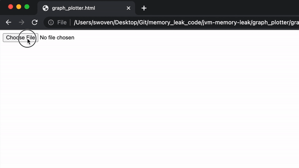

# jvm-memory-leak
Repository aims to provide sets of tool to detect memory leak

#### Memory Leak
In order to detect and mitigate the memory leak issues below questions needs to be answered.

1. Do I have a leak?
2. What is leaking?
3. What is keeping Object alive?
4. Where is it leaking from?

**garbage_collection_tracker.c** This file will help us to answer our first question by detecting where a running JVM has a leak.

How can **garbage_collection_tracker.c** detect the leak? It tracks the garbage collection and calculates the heap size before and after a garbage collection, and if there is increase in the heap size even after garbage collection, and the heap size is continuously growing then there might be a memory leak.

#### Example Log Printed
Initial Heap Size: 671 KB  
GC started: Fri Apr 15 21:34:38 2022 
GC stopped: Fri Apr 15 21:34:58 2022 
GC pause time: 20.00 ms 
Total Heap Size: 1024 KB 
GC started: Fri Apr 15 21:40:40 2022 
GC stopped: Fri Apr 15 21:40:60 2022 
GC pause time: 20.00 ms 
Total Heap Size: 2222 KB 
GC started: Fri Apr 15 21:50:38 2022 
GC stopped: Fri Apr 15 21:50:58 2022 
GC pause time: 20.00 ms 
Total Heap Size: 3333 KB 
GC started: Fri Apr 15 21:59:00 2022 
GC stopped: Fri Apr 15 22:01:03 2022 
GC pause time: 63.00 ms 
Total Heap Size: 5543 KB 

#### Log Explanation
Initial Heap Size: First heap size Measured  
GC started: Time when garbage collection started  
GC stopped: Time when garbage collection stopped  
GC pause time: Total time garbage collection took to complete in ms 
Total Heap Size: Heap size measured just after garbage collection completed  

According to the example log, heap size is increasing even after garbage collection, therefore we can predict there might be a memory leak.  

### How to use it ?
1. Execute the script ./create_so_file.sh with the parameter $JAVA_HOME, as an example ./create_so_file.sh $JAVA_HOME
2. It created a .so file in the same folder, Attach the shared file as a agent to the JVM, as an example: java -agentpath:./gar.so=/Users/$user_name/Desktop/mleak.log,KB Test

Note: Options needs to be passed to the agent in comma seperated format, first option is the path of file where you would want to print the log and the second option is the unit of heap size as an example 'java -agentpath:./gar.so=/Users/swoven/Desktop/mleak.log,KB Test', in this command (Before comma)/Users/swoven/Desktop/mleak.log is the path where the log will be printed and the heap size will be printed in KB (after comma) unit.

Heap size unit currently supported are KB, MB and GB.

### Plotting a graph
Open the HTML file graph_plotter.html, and then upload the log file to browser, to view the map.

